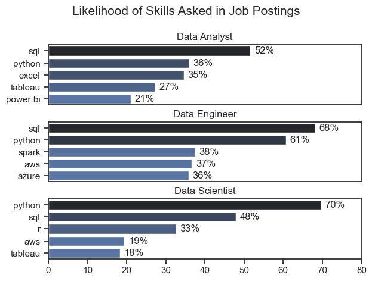
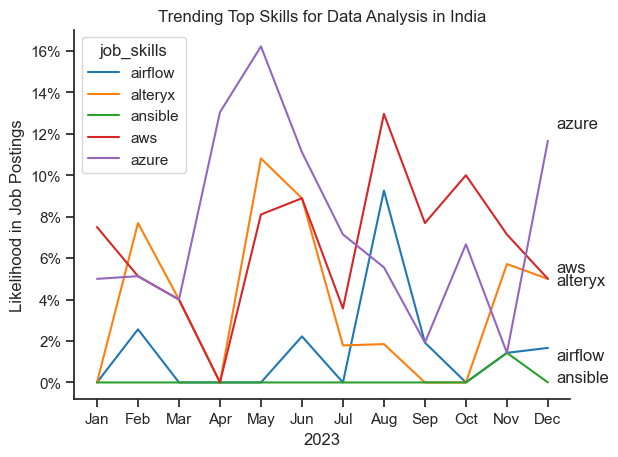
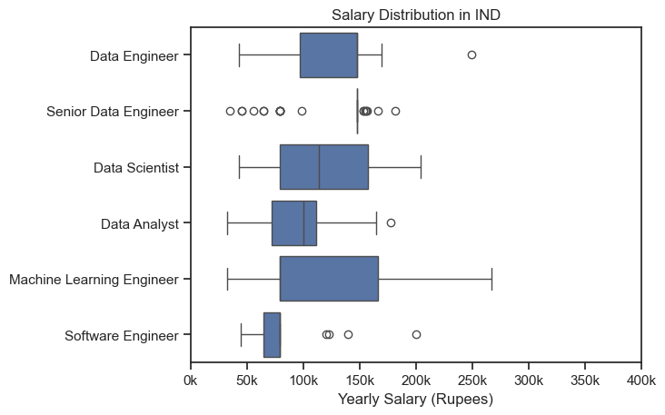
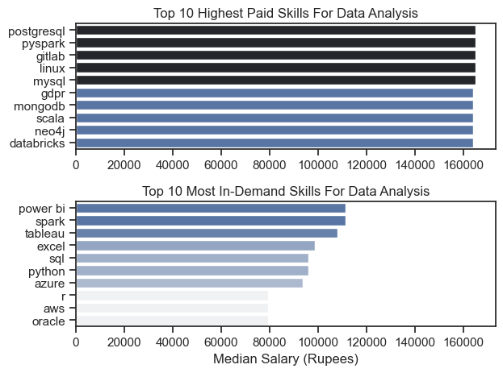
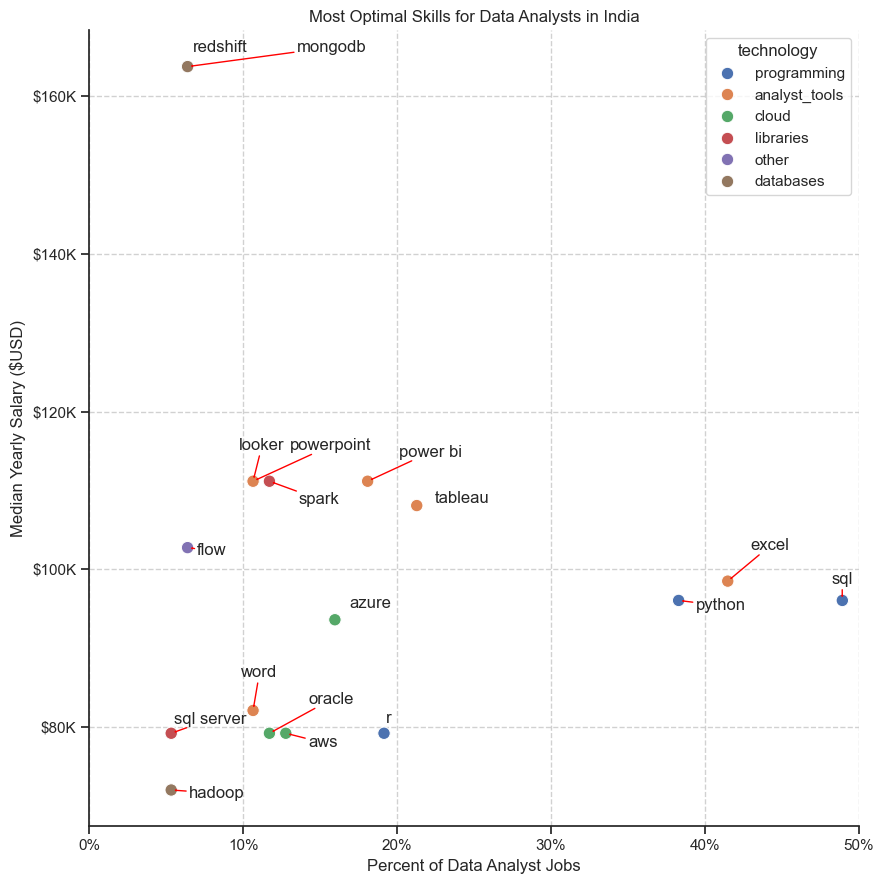

# Overview

Welcome to my analysis of the data job market, focusing on data analyst roles. This project was created out of a desire to navigate and understand the job market more effectively. It delves into the top-paying and in-demand skills to help find optimal job opportunities for data analysts.

The data sourced from Luke Barousse's Python Course which provides a foundation for my analysis, containing detailed information on job titles, salaries, locations, and essential skills. Through a series of Python scripts, I explore key questions such as the most demanded skills, salary trends, and the intersection of demand and salary in data analytics.

# The Questions

### Below are the questions I want to answer in my project:

1. What are the skills most in demand for the top 3 most popular data roles?

2. How are in-demand skills trending for Data Analysts?

3. How well do jobs and skills pay for Data Analysts?

4. What are the optimal skills for data analysts to learn? (High Demand AND High Paying)


# Tools I Used


For my deep dive into the data analyst job market, I harnessed the power of several key tools:

- Python: The backbone of my analysis, allowing me to analyze the data and find critical insights. I also used the following Python libraries:

- Pandas Library: This was used to analyze the data.
- Matplotlib Library: I visualized the data.
- Seaborn Library: Helped me create more advanced visuals.
- Jupyter Notebooks: The tool I used to run my Python scripts which let me easily include my notes and analysis.

- Visual Studio Code: My go-to for executing my Python scripts.

- Git & GitHub: Essential for version control and sharing my Python code and analysis, ensuring collaboration and accessibility.


# The Analysis

## 1. What are the most demanded skills for the top 3 most popular data roles?

The most demanded skills for the top 3 popular data roles were determined by selecting these roles based on their popularity and identifying their top 5 skills. This analysis provides a clear view of the most important skills to focus on, depending on your target role.

view my notebook with detailed steps here:
[2_skills_count.ipynb](Project_conda\Project_3.0\2_skills_count.ipynb)

### Visualize Data

    fig, ax = plt.subplots(len(job_titles),1)
    sns.set_theme(style='ticks')

    for i, job_title in enumerate(job_titles):
 
    df_plot = df_skills_perc[df_skills_perc['job_title_short'] == job_title].head(5)
    df_plot = df_plot.sort_values(by='skill_percent', ascending=False)

    sns.barplot(data=df_plot, x='skill_percent', y='job_skills', ax=ax[i], hue='skill_count',palette='dark:b_r')
    ax[i].set_title(job_title)
    ax[i].set_ylabel('')
    ax[i].set_xlabel('')
    ax[i].legend().set_visible(False)
    ax[i].set_xlim(0, 80)
    
    for n, v in enumerate(df_plot['skill_percent']):
        ax[i].text(v+1,n,f'{v:.0f}%', va='center')
    if i != len(job_titles)-1:
        ax[i].set_xticks([])    

    fig.suptitle('Likelihood of Skills Asked in Job Postings', fontsize=15)
     fig.tight_layout(h_pad=0.5)
    plt.show()

### Results 



### Insights 

- Data Analyst: SQL (52%) is most in demand, followed by Python (36%) and Excel (35%). Visualization tools like Tableau (27%) and Power BI (21%) are also important.
- Data Engineer: SQL (68%) and Python (61%) dominate, with Spark (38%), AWS (37%), and Azure (36%) as key cloud-related skills.
- Data Scientist: Python (70%) and SQL (48%) lead, with R (33%) and some demand for AWS (19%) and Tableau (18%).
- SQL and Python are essential across all roles, with specialized tools varying by position.

## 2. How are in-demand skills trending for Data Analysts?

### Visualize Data
```
df_plot = df_DA_IND_percent.iloc[:,:5]
sns.lineplot(data=df_plot, dashes=False, palette='tab10')
sns.set_theme(style='ticks')
sns.despine()

plt.title('Trending Top Skills for Data Analysis in India')
plt.ylabel('Likelihood in Job Postings')
plt.xlabel('2023')

from matplotlib.ticker import PercentFormatter
ax = plt.gca()
ax.yaxis.set_major_formatter(PercentFormatter(decimals=0))

# Add labels with adjusted positions to avoid overlap
for i in range(5):
    y_pos = df_plot.iloc[-1, i]
    adjustment = (i - 2) * 0.3  # Adjust labels by their index for spacing
    plt.text(11.2, y_pos + adjustment, df_plot.columns[i])


```    

### Results 


*line graph visualizing the trending top skills for data analysts in IND in 2023.*

### Insights:

- Azure has consistently been the most in-demand skill throughout the year, with its popularity peaking in May and remaining high through December.
- AWS has seen a significant rise in demand, especially from October to December.
- Alteryx and Ansible have also experienced increased interest, particularly in the latter half of the year.
- Airflow has shown a more volatile trend, with spikes in demand in February, June, and October.


## 3. How will do jobs and skills pay for Data Analysts?

### Salary Analysis for Data Nerds

#### Visualize Data

```
sns.boxplot(data=df_IND_top6,x='salary_year_avg',y='job_title_short', order=job_order)
sns.set_theme(style='ticks')
plt.title('Salary Distribution in IND')
plt.xlabel('Yearly Salary (Rupees)')
plt.ylabel('')
plt.xlim(0,400000)
ticks_x = plt.FuncFormatter(lambda y, pos: f'{int(y/1000)}k')
plt.gca().xaxis.set_major_formatter(ticks_x)
plt.show()
```
#### Results


*Box plot visualizing the salary distribution for the top 6 data job titles.*

#### Insights: 

- Machine Learning Engineers show the widest salary range and largest box size, indicating high variability in compensation - from around 50K to 250K rupees annually.

- Senior Data Engineers have multiple outliers (shown as circles) but a surprisingly compact core salary range, suggesting most are paid similarly with some exceptional cases.

- Data Scientists have the second-largest spread in their typical salary range, with substantial overlap with Machine Learning Engineer salaries.

- Data Analysts have a relatively compact salary range, clustering around 75K-125K rupees, with one notable outlier.

- Software Engineers show the most concentrated salary distribution (smallest box), but with several outliers reaching up to about 250K rupees.

- Among all roles, Data Engineers seem to have the most balanced distribution with a moderate spread and a median around 125K rupees.

- This visualization suggests that ML Engineers and Data Scientists generally command higher and more variable salaries, while Data Analysts and Software Engineers have more standardized compensation packages in the Indian market.


### Highest Paid & Most Demanded Skills for Data

#### Visualize Data

```
fig, ax=plt.subplots(2,1)
sns.set_theme(style="ticks")
sns.barplot(data=df_DA_top_pay,x='median',y=df_DA_top_pay.index,ax=ax[0],hue='median',palette='dark:b_r') #_r to reverse color
ax[0].legend().remove()
# df_DA_top_pay[::-1].plot(kind='barh',y='median',ax=ax[0],legend=False)
ax[0].set_title('Top 10 Highest Paid Skills For Data Analysis')
ax[0].set_ylabel('')
ax[0].set_xlabel('')
# ax[0].invert_yaxis() this or above colon method to invert
# df_DA_skills[::-1].plot(kind='barh',y='median',ax=ax[1],legend=False)
sns.barplot(data=df_DA_skills,x='median',y=df_DA_skills.index,ax=ax[1],hue='median',palette='light:b')
ax[1].legend().remove()
ax[1].set_title('Top 10 Most In-Demand Skills For Data Analysis')
ax[1].set_ylabel('')
ax[1].set_xlabel('Median Salary (Rupees)')
ax[1].set_xlim(ax[0].get_xlim())
plt.tight_layout()
plt.show()
```


*Two separate bar graphs visualizing the highest paid skills and most in-demand skills for data analysts in India.*

#### Insights:

Top 10 Highest Paid Skills for Data Analysis:

- Postgresql commands the highest salary, followed closely by Pyspark and Gitlab.
- Linux and MySQL also have high salaries, indicating strong demand for system administration and database management skills.
- GDPR (General Data Protection Regulation) compliance is a crucial skill, likely due to increasing data privacy regulations.

Top 10 Most In-Demand Skills for Data Analysis:

- Power BI and Spark are the most in-demand skills, suggesting a strong market for data visualization and big data processing.
- Tableau and Excel remain essential tools for data analysis and reporting.
- SQL and Python are fundamental programming languages for data manipulation and analysis.
- Cloud platforms like Azure and AWS are gaining popularity, indicating a shift towards cloud-based data solutions.


## 4. What is the most optimal skill to learn for Data Analysts?

#### Visualize Data
```
from matplotlib.ticker import PercentFormatter
from adjustText import adjust_text

sns.scatterplot(
    data=df_plot,
    x='skill_percent',
    y='median_salary',
    hue='technology', 
    s=80
)
sns.despine()
sns.set_theme(style='ticks')
texts = []
for i, txt in enumerate(df_DA_skills_high_demand.index):
 texts.append(plt.text(df_DA_skills_high_demand['skill_percent'].iloc[i], df_plot['median_salary'].iloc[i], txt))

plt.xlim(0, 50)
adjust_text(texts, arrowprops=dict(arrowstyle='->', color='red', lw=1.0))
ax=plt.gca()
ax.yaxis.set_major_formatter(plt.FuncFormatter(lambda y,pos:f'${int(y/1000)}K'))
ax.xaxis.set_major_formatter(PercentFormatter(decimals=0))
plt.ylabel('Median Yearly Salary ($USD)')
plt.xlabel('Percent of Data Analyst Jobs')
plt.title('Most Optimal Skills for Data Analysts in India')
plt.gcf().set_size_inches(9, 9)
plt.grid(True, linestyle='--', alpha=0.9)
plt.tight_layout()
plt.show()
```


*A scatter plot visualizing the most optimal skills (high paying and high deemand) for data analysts in India.*

#### Insights: 

- Skill demand is not the sole determinant of salary: While high demand often correlates with higher salaries, there are exceptions like SQL and Excel, which are in high demand but have moderate salaries.
- Technical skills are highly valued: Programming languages and cloud technologies are generally associated with higher salaries.
- Data visualization and business intelligence tools like Power BI and Tableau are in high demand and well-rewarded.
- Domain-specific skills like Hadoop and Redshift, while valuable, may have lower demand and salaries depending on the industry.

# What I Learned

- Throughout this project, I deepened my understanding of the data analyst job market and enhanced my technical skills in Python, especially in data manipulation and visualization. Here are a few specific things I learned:

- Advanced Python Usage: Utilizing libraries such as Pandas for data manipulation, Seaborn and Matplotlib for data visualization, and other libraries helped me perform complex data analysis tasks more efficiently.

- Data Cleaning Importance: I learned that thorough data cleaning and preparation are crucial before any analysis can be conducted, ensuring the accuracy of insights derived from the data.

- Strategic Skill Analysis: The project emphasized the importance of aligning one's skills with market demand. Understanding the relationship between skill demand, salary, and job availability allows for more strategic career planning in the tech industry.

# Insights

### This project provided several general insights into the data job market for analysts:

- Skill Demand and Salary Correlation: There is a clear correlation between the demand for specific skills and the salaries these skills command. Advanced and specialized skills like Python and Oracle often lead to higher salaries.

- Market Trends: There are changing trends in skill demand, highlighting the dynamic nature of the data job market. Keeping up with these trends is essential for career growth in data analytics.

- Economic Value of Skills: Understanding which skills are both in-demand and well-compensated can guide data analysts in prioritizing learning to maximize their economic returns.

# Challenges I Faced

### This project was not without its challenges, but it provided good learning opportunities:

- Data Inconsistencies: Handling missing or inconsistent data entries requires careful consideration and thorough techniques to ensure the integrity of the analysis.
- Complex Data Visualization: Designing effective visual representations of complex datasets was challenging, requiring careful consideration to convey insights clearly and compellingly.
- Balancing Breadth and Depth: Deciding how deeply to dive into each analysis while maintaining a broad overview of the landscape required constant balancing to ensure comprehensive coverage without getting lost in details.

# Conclusion

This exploration into the data analyst job market has been incredibly informative, highlighting the critical skills and trends that shape this evolving field. The insights I got enhance my understanding and provide actionable guidance for anyone looking to advance their career in data analytics. As the market continues to change, ongoing analysis will be essential to stay ahead in data analytics. This project is a good foundation for future explorations and underscores the importance of continuous learning and adaptation in the data field.


    


